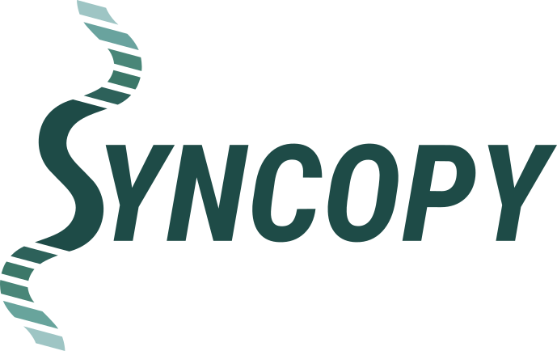

.. Syncopy documentation master file, created by

.. title:: Syncopy Documentation
   

Welcome to Syncopy's Documentation!
===================================

Syncopy (Systems Neuroscience COmputing in Python) is a Python toolkit for
user-friendly, large-scale electrophysiology data analysis. The goals of the
project are:

1. Syncopy provides a fully *open source* Python environment for reproducable
   electrophysiology data analysis.
2. Syncopy is *scalable* for large datasets. It automatically makes use of the
   available computing resources by being developed with built-in parallelism.
3. Syncopy is *compatible* with the MATLAB toolbox FieldTrip.

Contents
========
.. toctree::
   :maxdepth: 2

   quickstart
   user/users.rst    
   developer/developers.rst   

Indices and tables
==================

* :ref:`genindex`
* :ref:`search`
