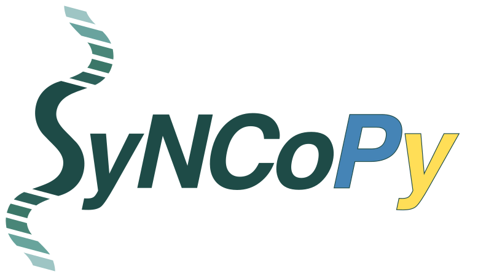

.. Syncopy documentation master file

.. title:: Syncopy Documentation
   

Welcome to the Documentation of SyNCoPy!
========================================

SyNCoPy (**Sy**\stems **N**\euroscience **Co**\mputing in **Py**\thon, spelled Syncopy in the following) 
is a Python toolkit for user-friendly, large-scale electrophysiology data analysis. 
We strive to achieve the following goals:

1. Syncopy provides a full *open source* Python environment for reproducible
   electrophysiology data analysis.
2. Syncopy is *scalable* to accommodate *very large* datasets. It automatically 
   makes use of available computing resources and is developed with built-in 
   parallelism in mind.
3. Syncopy is *compatible* with the MATLAB toolbox `FieldTrip <http://www.fieldtriptoolbox.org/>`_.

Getting Started
---------------
- Prerequisites: :doc:`Install Syncopy </setup>`
- Jumping right in: :doc:`Quickstart Guide <quickstart/quickstart>`

Want to contribute or just curious how the sausage 
is made? Take a look at our :doc:`Developer Guide <developer/developers>`. 

In depth Guides and Tutorials
-----------------------------
* :doc:`General User Guide <user/users>`

Navigation
----------
* :doc:`Sitemap <sitemap>`
* :ref:`genindex`
* :ref:`search`

Contact
-------
To report bugs or ask questions please use our `GitHub issue tracker <https://github.com/esi-neuroscience/syncopy/issues>`_. 
For general inquiries please contact syncopy (at) esi-frankfurt.de. 

.. Any sections to be included in the Documentation dropdown menu have to be in the toctree

.. toctree::
   :hidden:

   quickstart/quickstart.rst
   setup
   user/users.rst
   user/user_api.rst
   developer/developers.rst   
