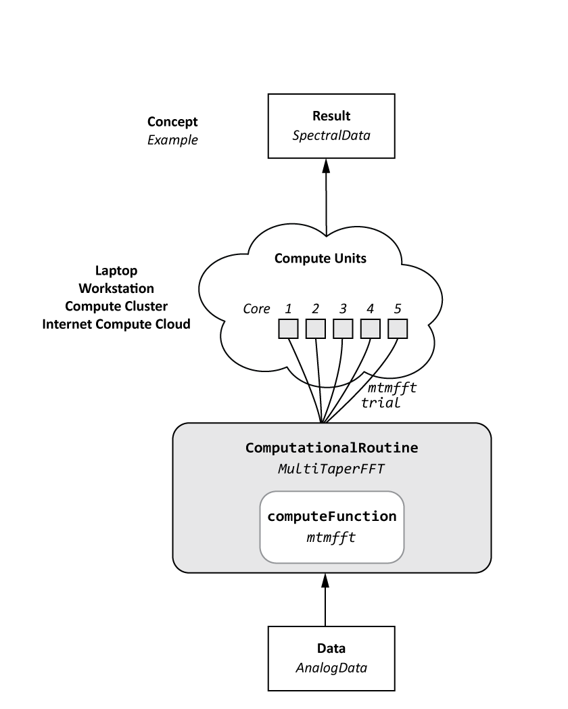

Tools for Developing Syncopy
============================
The following is a collection of routines, decorators and classes that constitute
the basic building blocks of Syncopy. Syncopy's entire source-code is built using 
following a modular structure where basic building blocks are written (and tested)
once and then re-used throughout the entire package. 

Input Parsing and Error Checking
--------------------------------

.. autosummary::
   :toctree: _stubs    
   
   syncopy.shared.parsers.array_parser
   syncopy.shared.parsers.data_parser
   syncopy.shared.parsers.filename_parser
   syncopy.shared.parsers.io_parser
   syncopy.shared.parsers.scalar_parser

Decorators
----------

.. autosummary::
   :toctree: _stubs    
   
   syncopy.shared.kwarg_decorators.unwrap_cfg
   syncopy.shared.kwarg_decorators.unwrap_select
   syncopy.shared.kwarg_decorators.unwrap_io
   syncopy.shared.kwarg_decorators.detect_parallel_client

Writing A New Analysis Routine
------------------------------
Any analysis routine that operates on Syncopy data is always structured in three
(hierarchical) parts:

1. A numerical function based only on NumPy/SciPy that works on a
   :class:`numpy.ndarray` and returns a :class:`numpy.ndarray`. 
2. A wrapper class that handles output initialization, potential
   parallelization and post-computation cleanup. The class should be based on the
   abstract class :class:`syncopy.shared.computational_routine.ComputationalRoutine`
3. Another wrapping metafunction handling method selection, parameterization and
   error checking is then provided for user interaction.

An example of this type of structure is the multi-taper fourier analysis. The
corresponding stages here are

1. Numerical function: :func:`syncopy.specest.mtmfft.mtmfft`
2. Wrapper class: :class:`syncopy.specest.mtmfft.MultiTaperFFT`
3. Metafunction: :func:`syncopy.freqanalysis` 

For a detailed walk-through explaining the intricacies of writing an analysis
routine, please refer to the :doc:`compute_kernels`.
