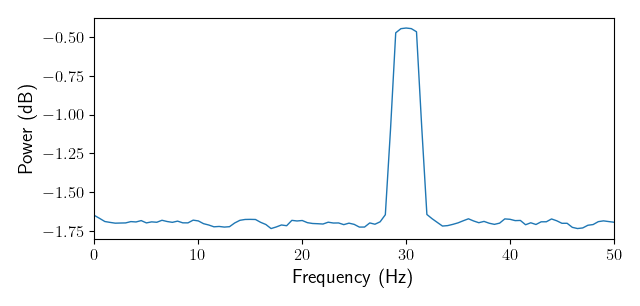
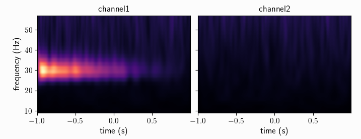

************************
Quickstart with Syncopy
************************

.. currentmodule:: syncopy

Here we want to quickly explore some standard analyses for analog data (e.g. MUA or LFP measurements), and how to do these in Syncopy. Explorative coding is best done interactively by using e.g. `Jupyter <https://jupyter.org>`_ or `IPython <https://ipython.org>`_. Note that for plotting also `matplotlib <https://matplotlib.org>`_ has to be installed.

.. contents:: Topics covered
   :local:

.. note::
   Installation of Syncopy itself is covered in :doc:`here </setup>`.

Preparations
============

To start with a clean slate, let's construct a synthetic dataset consisting of a damped harmonic and additive white noise:

.. literalinclude:: /quickstart/damped_harm.py

With this we have a dataset of type :class:`~syncopy.AnalogData`, which is intended for holding time-series data like electrophys. measurements.

To recap: we have generated a synthetic dataset white noise on both channels, and ``channel1`` additionally carries the damped harmonic signal.

.. hint::
   Further details about artificial data generation can be found at the :ref:`synth_data` section.

Data Object Inspection
======================

We can get some basic information about any Syncopy dataset by just typing its name in an interpreter:

.. code-block:: python

   data

which gives nicely formatted output:

.. code-block:: bash

   Syncopy AnalogData object with fields

            cfg : dictionary with keys ''
        channel : [2] element <class 'numpy.ndarray'>
      container : None
           data : 50 trials of length 1000.0 defined on [50000 x 3] float64 Dataset of size 1.14 MB
         dimord : time by channel
       filename : /xxx/xxx/.spy/spy_910e_572582c9.analog
           mode : r+
     sampleinfo : [50 x 2] element <class 'numpy.ndarray'>
     samplerate : 500.0
            tag : None
           time : 50 element list
      trialinfo : [50 x 0] element <class 'numpy.ndarray'>
         trials : 50 element iterable

   Use `.log` to see object history

So we see that we indeed got 50 trials with 2 channels and 1000 samples each. Note that Syncopy per default **stores and writes all data on disk**, as this allows for seamless processing of **larger than memory** datasets. The exact location and filename of a dataset in question is listed at the ``filename`` field. The standard location is the ``.spy`` directory created automatically in the user's home directory. To change this and for more details please see :ref:`setup_env`.

.. hint::
   You can access each of the shown meta-information fields separately using standard Python attribute access, e.g. ``data.filename`` or ``data.samplerate``.

Time-Frequency Analysis
=======================

Syncopy groups analysis functionality into *meta-functions*, which in turn have various parameters selecting and controlling specific methods. In the case of spectral analysis the function to use is :func:`~syncopy.freqanalysis`.

Here we quickly want to showcase two important methods for (time-)frequency analysis: (multi-tapered) FFT and Wavelet analysis.

Multitapered Fourier Analysis
------------------------------

`Multitaper methods <https://en.wikipedia.org/wiki/Multitaper>`_ allow for frequency smoothing of Fourier spectra. Syncopy implements the standard `Slepian/DPSS tapers <https://en.wikipedia.org/wiki/Window_function#DPSS_or_Slepian_window>`_ and provides a convenient parameter, the *taper smoothing frequency* ``tapsmofrq`` to control the amount of spectral smoothing in Hz. To perform a multi-tapered Fourier analysis with 3Hz spectral smoothing, we simply do:

.. code-block::

   fft_spectra = spy.freqanalsysis(data, method='mtmfft', foilim=[0, 50], tapsmofrq=3)

The parameter ``foilim`` controls the *frequencies of interest  limits*, so in this case we are interested in the range 0-50Hz. Starting the computation interactively will show additional information::

  Syncopy <validate_taper> INFO: Using 5 taper(s) for multi-tapering

informing us, that for this dataset a spectral smoothing of 3Hz required 5 Slepian tapers.

The resulting new dataset ``fft_spectra`` is of type :class:`syncopy.SpectralData`, which is the general datatype storing the results of a time-frequency analysis.

.. hint::
   Try typing ``fft_spectra.log`` into your interpreter and have a look at :doc:`Trace Your Steps: Data Logs </user/logging>` to learn more about Syncopy's logging features

To quickly have something for the eye we can plot the power spectrum using the generic :func:`syncopy.singlepanelplot`::

  fft_spectra.singlepanelplot()

The originally very sharp harmonic peak around 30Hz for channel 1 got widened to about 3Hz, channel 2 just contains the flat white noise floor.

The related short time Fourier transform can be computed via ``method='mtmconvol'``, see :func:`~syncopy.freqanalysis` for more details and examples.

Wavelet Analysis
----------------

`Wavelet Analysis <https://en.wikipedia.org/wiki/Continuous_wavelet_transform>`_, especially with `Morlet Wavelets <https://en.wikipedia.org/wiki/Morlet_wavelet>`_, is a well established method for time-frequency analysis. For each frequency of interest (``foi``), a Wavelet function gets convolved with the signal yielding a time dependent cross-correlation. By (densely) scanning a range of frequencies, a continuous time-frequency representation of the original signal can be generated.

In Syncopy we can compute the Wavelet transform by calling :func:`~syncopy.freqanalysis` with the ``method='wavelet'`` argument::

  # define frequencies to scan
  fois = np.arange(10, 50, step=2) # 2Hz stepping
  wav_spectra = spy.freqanalysis(data,
                                 method='wavelet',
				 foi=fois,
				 parallel=True,
				 keeptrials=False)

Here we used two additional parameters supported by every Syncopy analysis method:

- ``parallel=True`` invokes Syncopy's parallel processing engine
- ``keeptrials=False`` triggers trial averaging

.. hint::

   If parallel processing is unavailable, have a look at :ref:`install_acme`

To quickly inspect the results for each channel we can use::

  wav_spectra.multipanelplot()

Again, we see a strong 30Hz signal in the 1st channel, and channel 2 is devoid of any rhythms. However, in contrast to the ``method=mtmfft`` call,  now we also get information along the time axis. The dampening of the harmonic over time in channel 1 is clearly visible.

An improved method, the superlet transform, providing super-resolution time-frequency representations can be computed via ``method='superlet'``, see :func:`~syncopy.freqanalysis` for more details.

Connectivity Analysis
=====================

Having time-frequency results for individual channels is useful, however we hardly learn anything about functional relationships between these different units. Even if two channels have a spectral peak at say 30Hz, we don't know if these signals are actually connected. Syncopy offers various distinct methods to elucidate such putative connections: coherence, cross-correlation and Granger-Geweke causality.

Setup
-----

To have a synthetic albeit meaningful dataset to illustrate the different methodologies

Coherence
---------

