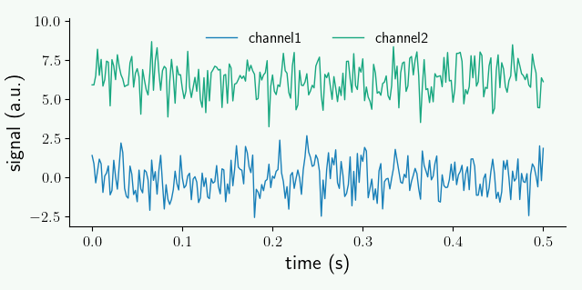
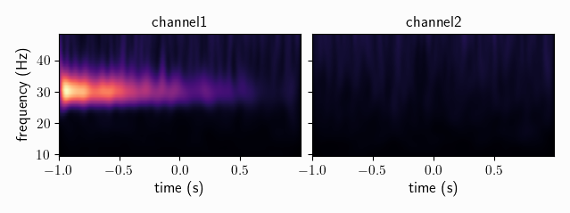

.. _quick_start:

************************
Quickstart with Syncopy
************************

Here we want to quickly explore some standard analyses for analog data (e.g. MUA or LFP measurements), and how to do these in Syncopy. Explorative coding is best done interactively by using e.g. `Jupyter <https://jupyter.org>`_ or `IPython <https://ipython.org>`_. Note that for plotting also `matplotlib <https://matplotlib.org>`_ has to be installed.

.. contents:: Topics covered
   :local:

.. note::
   Installation of Syncopy itself is covered in :doc:`here </setup>`.

Preparations
============

To start with a clean slate, let's construct a synthetic dataset consisting of a damped 30Hz harmonic and additive white noise:

.. literalinclude:: /quickstart/damped_harm.py

With this we have a dataset of type :class:`~syncopy.AnalogData`, which is intended for holding time-series data like electrophys. measurements. Let's have a look at a small snippet of the 1st trial::

  data.singlepanelplot(trials=0, latency=[0, 0.5])

By construction, we made the (white) noise of the same strength as the signal, hence by eye the oscillations present in channel1 are hardly visible. The parameter ``latency`` defines a time-interval selection here.

To recap: we have generated a synthetic dataset white noise on both channels, and channel1 additionally carries the damped harmonic signal.

.. hint::
   Further details about artificial data generation can be found at the :ref:`synth_data` section.

Data Object Inspection
======================

We can get some basic information about any Syncopy dataset by just typing its name in an interactive Python interpreter:

.. code-block:: python

   data

which gives nicely formatted output:

.. code-block:: bash

   Syncopy AnalogData object with fields

            cfg : dictionary with keys ''
        channel : [2] element <class 'numpy.ndarray'>
      container : None
           data : 50 trials of length 1000.0 defined on [50000 x 2] float64 Dataset of size 1.14 MB
         dimord : time by channel
       filename : /xxx/xxx/.spy/spy_910e_572582c9.analog
           mode : r+
     sampleinfo : [50 x 2] element <class 'numpy.ndarray'>
     samplerate : 500.0
            tag : None
           time : 50 element list
      trialinfo : [50 x 0] element <class 'numpy.ndarray'>
         trials : 50 element iterable

   Use `.log` to see object history

So we see that we indeed got 50 trials with 2 channels and 1000 samples each. Note that Syncopy per default **stores and writes all data on disk**, as this allows for seamless processing of **larger than memory** datasets. The exact location and filename of a dataset in question is listed at the ``filename`` field. The standard location is the ``.spy`` directory created automatically in the user's home directory. To change this and for more details please see :ref:`setup_env`.

.. hint::
   You can access each of the shown meta-information fields separately using standard Python attribute access, e.g. ``data.filename`` or ``data.samplerate``.

Time-Frequency Analysis
=======================

Syncopy groups analysis functionality into *meta-functions*, which in turn have various parameters selecting and controlling specific methods. In the case of spectral analysis the function to use is :func:`~syncopy.freqanalysis`.

Here we quickly want to showcase two important methods for (time-)frequency analysis: (multi-tapered) FFT and Wavelet analysis.

.. _mtmfft:

Multitapered Fourier Analysis
------------------------------

`Multitaper methods <https://en.wikipedia.org/wiki/Multitaper>`_ allow for frequency smoothing of Fourier spectra. Syncopy implements the standard `Slepian/DPSS tapers <https://en.wikipedia.org/wiki/Window_function#DPSS_or_Slepian_window>`_ and provides a convenient parameter, the *taper smoothing frequency* ``tapsmofrq`` to control the amount of one-sided spectral smoothing in Hz. To perform a multi-tapered Fourier analysis with 2Hz spectral smoothing, we simply do:

.. code-block::

   fft_spectra = spy.freqanalysis(data, method='mtmfft', foilim=[0, 60], tapsmofrq=1)

The parameter ``foilim`` controls the *frequencies of interest  limits*, so in this case we are interested in the range 0-60Hz. Starting the computation interactively will show additional information::

  Syncopy <validate_taper> INFO: Using 7 taper(s) for multi-tapering

informing us, that for this dataset a total spectral smoothing of 2Hz required 7 Slepian tapers.

The resulting new dataset ``fft_spectra`` is of type :class:`syncopy.SpectralData`, which is the general datatype storing the results of a time-frequency analysis.

.. hint::
   Try typing ``fft_spectra.log`` into your interpreter and have a look at :doc:`Trace Your Steps: Data Logs </user/logging>` to learn more about Syncopy's logging features

To quickly have something for the eye we can plot the power spectrum of a single trial using the generic :func:`syncopy.singlepanelplot`::

  fft_spectra.singlepanelplot(trials=3)

.. image:: mtmfft_spec.png
   :height: 260px

We clearly see a smoothed spectral peak at 30Hz, channel 2 just contains the flat white noise floor. Comparing with the signals plotted in the time domain above, we see the power of the frequency representation of an oscillatory signal.

The related short time Fourier transform can be computed via ``method='mtmconvol'``, see :func:`~syncopy.freqanalysis` for more details and examples.

.. note::
   Have a look at :ref:`workflow` to get an overview about data processing principles with Syncopy

Wavelet Analysis
----------------

`Wavelet Analysis <https://en.wikipedia.org/wiki/Continuous_wavelet_transform>`_, especially with `Morlet Wavelets <https://en.wikipedia.org/wiki/Morlet_wavelet>`_, is a well established method for time-frequency analysis. For each frequency of interest (``foi``), a Wavelet function gets convolved with the signal yielding a time dependent cross-correlation. By (densely) scanning a range of frequencies, a continuous time-frequency representation of the original signal can be generated.

In Syncopy we can compute the Wavelet transform by calling :func:`~syncopy.freqanalysis` with the ``method='wavelet'`` argument::

  # define frequencies to scan
  fois = np.arange(10, 60, step=2) # 2Hz stepping
  wav_spectra = spy.freqanalysis(data,
                                 method='wavelet',
				 foi=fois,
				 parallel=True,
				 keeptrials=False)

Here we used two additional parameters supported by every Syncopy analysis method:

- ``parallel=True`` invokes Syncopy's parallel processing engine
- ``keeptrials=False`` triggers trial averaging

.. hint::

   If parallel processing is unavailable, have a look at :ref:`install_acme`

To quickly inspect the results for each channel we can use::

  wav_spectra.multipanelplot()

Again, we see a strong 30Hz signal in the 1st channel, and channel 2 is devoid of any rhythms. However, in contrast to the ``method='mtmfft'`` call, now we also get information along the time axis. The dampening of the 30Hz harmonic over time in channel 1 is clearly visible.

An improved method, the superlet transform, providing super-resolution time-frequency representations can be computed via ``method='superlet'``, see :func:`~syncopy.freqanalysis` for more details.

Preprocessing
=============

Raw data often contains unwanted signal components: offsets, trends or even oscillatory nuisance signals. Syncopy has a dedicated :func:`~syncopy.preprocessing` function to deal with all of those. Let's start by creating confounding components for our synthetic dataset:

.. literalinclude:: /quickstart/add_nuisance.py

Dataset Arithmetics
-------------------

If the *shape* of different Syncopy objects match exactly (``nSamples``, ``nChannels`` and ``nTrials`` are all the same), we can use **standard Python arithmetic operators** like **+**, **-**, ***** and **/** directly. Here we want a linear superposition, so we simply add everything together::

  # add the trend and the nuisance harmonic
  data_nui = data + lin_trend + harm50
  # also works for scalars
  data_nui = data_nui + 5

If we now do a spectral analysis, the power spectra are confounded by all our new signal components::

  cfg = spy.StructDict()
  cfg.tapsmofrq = 1
  cfg.foilim = [0, 60]
  cfg.polyremoval = None
  cfg.keeptrials = False   # trial averaging
  fft_nui_spectra = spy.freqanalysis(data_nui, cfg)

Here we used a ``cfg`` structure to assemble all needed parameters for our analysis, a concept we adopted from `FieldTrip <https://www.fieldtriptoolbox.org/>`_

.. note::
   We explicitly set ``polyremoval=None`` to see the full effect of our confounding signal components. The default for :func:`~syncopy.freqanalysis` is ``polyremoval=0``, which removes polynoms of 0th order: constant offsets (*de-meaning*).

.. hint::
   We did not specify the ``method`` parameter for the ``spy.freqanalysis`` call as multi-tapered Fourier analysis (``method='mtmfft'``) is the default. To learn about the defaults of any Python function you can inspect its signature with ``spy.freqanalysis?`` or ``help(spy.freqanalysis)`` typed into an interpreter

Let's see what we got::

  fft_nui_spectra.singlepanelplot()

.. image:: fft_nui_spec.png
   :height: 250px

We see strong low-frequency components, originating from both the offset and the trend. We also see the nuisance signal spectral peak at 50Hz.

Filtering
---------
Filtering of signals in general removes/suppresses unwanted signal components. This can be done both in the *time-domain* and in the *frequency-domain*. For offsets and (low-order) polynomial trends, fitting a model directly in the time domain, and subtracting the obtained trend, is the preferred solution. This can be controlled in Syncopy with the ``polyremoval`` parameter, which is also directly available in :func:`~syncopy.freqanalysis`.

Removing signal components in the frequency domain is typically done with *finite impulse response* (FIR) filters or *infinite impulse response* (IIR) filters. Syncopy supports one of each kind, a FIR `windowed sinc <https://en.wikipedia.org/wiki/Sinc_filter>`_ and the `Butterworth filter <https://en.wikipedia.org/wiki/Butterworth_filter>`_ from the IIR family. For both filters we have low-pass (``'lp'``), high-pass (``'hp'``), band-pass (``'bp'``) and band-stop(Notch) (``'bp'``) designs available.

To clean up our dataset above, we remove the linear trend and apply a low-pass 12th order Butterworth filter::

  data_pp = spy.preprocessing(data_nui,
                              filter_class='but',
			      filter_type='lp',
			      polyremoval=1,
			      freq=40,
			      order=12)

Now let's reuse our ``cfg`` from above to repeat the spectral analysis with the preprocessed data::

  spec_pp = spy.freqanalysis(data_pp, cfg)
  spec_pp.singlepanelplot()

.. image:: fft_pp_spec.png
   :height: 250px

As expected for a low-pass filter, all frequencies above 40Hz are strongly attenuated (note the log scale, so the suppression is around 2 orders of magnitude). We also removed the low-frequency components from the offset and trend, but acknowledge that we also lost a bit of the original white noise power around 0-2Hz. Importantly, the spectral power of our frequency band of interest, around 30Hz, remained virtually unchanged.

Connectivity Analysis
=====================

Having time-frequency results for individual channels is useful, however we hardly learn anything about functional relationships between these different units. Even if two channels have a spectral peak at say 100Hz, we don't know if these signals are actually connected. Syncopy offers various distinct methods to elucidate such putative connections via the :func:`~spy.connectivityanalysis` meta-function: coherence, cross-correlation and Granger-Geweke causality.

Setup
-----

To have a synthetic albeit meaningful dataset to illustrate the different methodologies we start by simulating two coupled autoregressive processes of order 2:

.. literalinclude:: /quickstart/ar2_nw.py

We also right away calculated the respective power spectra ``spec``.
We can quickly have a look at a snippet of the generated signals::

  data.singlepanelplot(trials=0, latency=[0, 0.5])

Both channels show visible oscillations as is confirmed by looking at the power spectra::

  spec.singlepanelplot()

As expected for the stochastic AR(2) model, we have a fairly broad spectral peak at around 100Hz.

..
   comment
   Careful when using :func:`~syncopy.show` on large datasets, as the output is loaded directly into memory. It is advisable to make sufficiently small selections (e.g. 1 channel, 1 trial) to avoid out-of-memory problems on your machine!

Coherence
---------
One way to check for relationships between different oscillating channels is to calculate the pairwise `coherence <https://en.wikipedia.org/wiki/Coherence_(signal_processing)>`_ measure. It can be roughly understood as a frequency dependent correlation. Let's do this for our coupled AR(2) signals::

  coherence = spy.connectivityanalysis(data, method='coh', tapsmofrq=3)

The result is of type :class:`spy.CrossSpectralData`, the standard datatype for all connectivity measures. It contains the results for all ``nChannels x nChannels`` possible combinations. Let's pick the two available channel combinations and plot the results::

  coherence.singlepanelplot(channel_i='channel1', channel_j='channel2')
  coherence.singlepanelplot(channel_i='channel2', channel_j='channel1')

As coherence is a *symmetric measure*, we have the same graph for both channel combinations, showing high coherence around 100Hz.

.. note::
   The plotting for ``CrossSpectralData`` object works a bit differently, as  the user here has to provide one channel combination for each plot with the keywords ``channel_i`` and ``channel_j``.

Cross-Correlation
-----------------
Coherence is a spectral measure for correlation, the corresponding time-domain measure is the well known cross-correlation. In Syncopy we can get the cross-correlation between all channel pairs with::

  corr = spy.connectivityanalysis(data, method='corr', keeptrials=True)

As this also is a symmetric measure, let's just look at the only channel combination however this time for two different trials::

  corr.singlepanelplot(channel_i=0, channel_j=1, trials=0)
  corr.singlepanelplot(channel_i=0, channel_j=1, trials=1)

We see that there are persistent correlations also for longer lags.

Granger Causality
-----------------
To reveal directionality, or *causality*, between different channels Syncopy offers the Granger-Geweke algorithm for non-parametric Granger causality in the spectral domain::

  granger = spy.connectivityanalysis(data, method='granger', tapsmofrq=2)

Now we want to see differential causality, so we plot both channel combinations::

  granger.singlepanelplot(channel_i=0, channel_j=1)
  granger.singlepanelplot(channel_i=1, channel_j=0)

This reveals the coupling structure we put into this synthetic data set: ``channel1`` influences ``channel2``, but in the other direction there is no interaction.

.. note::
   The ``keeptrials`` keyword is only valid for cross-correlations, as both Granger causality and coherence critically rely on trial averaging.
