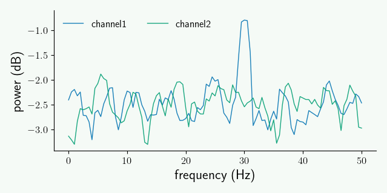

.. _quick_start:

************************
Quickstart with Syncopy
************************

Here we want to quickly explore some standard analyses for analog data (e.g. MUA or LFP measurements), and how to do these in Syncopy. Explorative coding is best done interactively by using e.g. `Jupyter <https://jupyter.org>`_ or `IPython <https://ipython.org>`_. Note that for plotting also `matplotlib <https://matplotlib.org>`_ has to be installed.

Users coming from `FieldTrip <https://www.fieldtriptoolbox.org/>`_ should also have a look at the :ref:`field_trip` section.

.. contents:: Topics covered
   :local:

.. note::
   Installation of Syncopy itself is covered in :doc:`here </setup>`.

Preparations
============

To start with a clean slate, let's construct a synthetic dataset consisting of a damped 30Hz harmonic
and additive red noise acting as a 1/f surrogate::

  import numpy as np
  import syncopy as spy

  # cfg dictionary
  cfg = spy.StructDict()
  cfg.nTrials = 50
  cfg.nSamples = 1000
  cfg.nChannels = 2
  cfg.samplerate = 500   # in Hz

  # 30Hz undamped harmonic
  harm = spy.synthdata.harmonic(cfg, freq=30)
  
  # red noise with seed for exact reproducibility
  noise = spy.synthdata.red_noise(cfg, alpha=0.9, seed=42)

To look at a single trial we can use the ``.trials`` property of Syncopy data objects, which behaves similar to Python lists where each element is a trial represented as a :class:`numpy.ndarray`::

  # how many trials do we have?
  print(harm.trials)
  >>> 50 element iterable

  # access the 1st trial as numpy array
  print(harm.trials[0].shape)
  >>> (1000, 2)

  # show order of dimensions
  print(harm.dimord)
  >>> ['time', 'channel']

So we see that as defined above we indeed have 50 trials, with each having 1000 samples and 2 channels.

For now we have two distinct datasets ``harm`` and ``noise``, we can combine them using standard arithmetic Python operators. But first let's actually dampen the harmonic and zero out the 2nd channel::

  # pseudo 2d array with shape (1000, 1) for the dampening
  harm = harm * np.linspace(1, 0.2, cfg.nSamples)[:, np.newaxis]
  
  # zero out 2nd channel with a (2,) shaped array
  harm = harm * np.array([1, 0])

To check that we got a damped harmonic on the first and just zeros on the second channel we can plot an arbitrary trial::

  # plot the 20th trial
  harm.singlepanelplot(trials=19)

.. image:: damped_harm.png
   :height: 220px

Finally we can just add our red noise dataset to arrive at our final synthetic dataset::

  # scale the noise up a bit
  adata = harm + 1.2 * noise

  # rename the channels
  adata.channel = ['30Hz + noise', 'noise only']
  
.. note::
   Syncopy arithmetics follow `NumPy's broadcasting rules <https://numpy.org/doc/stable/user/basics.broadcasting.html>`_ on a trial-by-trial basis. Meaning single arrays which are broadcastable to every trial OR Syncopy datasets where each trial-pair of both datasets is shape compatible are valid operands. 
  
``adata`` is a dataset of type :class:`~syncopy.AnalogData`, which is intended for holding time-series data like electrophysiological measurements. Let's have a look at a small snippet of the first trial::

  adata.singlepanelplot(trials=0, latency=[0, 0.5])

.. image:: damped_signals.png
   :height: 220px

By construction, we made the red noise of similar strength as the signal, hence by eye the oscillations present in ``channel1`` are hardly visible. The parameter ``latency`` defines a time-interval selection.

.. note::
   How to plot and work with subsets of Syncopy data is described in :ref:`selections`.

To recap: we have generated a synthetic dataset whith red noise on both channels, and ``channel1`` additionally carries the damped harmonic signal.

.. note::
   Further details about artificial data generation can be found at the :ref:`synthdata` section.

Data Object Inspection
======================

We can get some basic information about any Syncopy dataset by just typing its name in an interactive Python interpreter:

.. code-block:: python

   adata

which gives nicely formatted output:

.. code-block:: bash

   Syncopy AnalogData object with fields

            cfg : dictionary with keys ''
        channel : [2] element <class 'numpy.ndarray'>
      container : None
           data : 50 trials of length 1000.0 defined on [50000 x 2] float64 Dataset of size 0.76 MB
         dimord : time by channel
       filename : /xxx/xxx/.spy/spy_910e_572582c9.analog
           mode : r+
     sampleinfo : [50 x 2] element <class 'numpy.ndarray'>
     samplerate : 500.0
            tag : None
           time : 50 element list
      trialinfo : [50 x 0] element <class 'numpy.ndarray'>
         trials : 50 element iterable

   Use `.log` to see object history

So we see that we indeed got 50 trials with 2 channels and 1000 samples each. Note that Syncopy per default **stores and writes all data on disk**, as this allows for seamless processing of **larger than memory** datasets. The exact location and filename of a dataset in question is listed at the ``filename`` field. The standard location is the ``.spy`` directory created automatically in the user's home directory. To change this and for more details please see :ref:`setup_env`.

.. hint::
   You can access each of the shown meta-information fields separately using standard Python attribute access, e.g. ``data.filename`` or ``data.samplerate``.

Spectral Analysis
=================

Syncopy groups analysis functionality into *meta-functions*, which in turn have various parameters selecting and controlling specific methods. In the case of spectral analysis the function to use is :func:`~syncopy.freqanalysis`.

Here we quickly want to showcase two important methods for (time-)frequency analysis: (multi-tapered) FFT and Wavelet analysis.

.. _mtmfft:

Multitapered Fourier Analysis
------------------------------

`Multitaper methods <https://en.wikipedia.org/wiki/Multitaper>`_ allow for frequency smoothing of Fourier spectra. Syncopy implements the standard `Slepian/DPSS tapers <https://en.wikipedia.org/wiki/Window_function#DPSS_or_Slepian_window>`_ and provides a convenient parameter, the *taper smoothing frequency* ``tapsmofrq`` to control the amount of one-sided spectral smoothing in Hz. To perform a multi-tapered Fourier analysis with 2Hz spectral smoothing (1Hz two sided), we simply do::

  # increase log level
  spy.set_loglevel("INFO")

  # compute the spectra
  fft_spectra = spy.freqanalysis(adata, method='mtmfft', foilim=[0, 60], tapsmofrq=1)

The parameter ``foilim`` controls the *frequencies of interest  limits*, so in this case we are interested in the range 0-60Hz. Starting the computation interactively will show additional information::

  Syncopy <validate_taper> INFO: Using 3 taper(s) for multi-tapering

informing us, that for this dataset a total spectral smoothing of 2Hz required 3 Slepian tapers.

The resulting new dataset ``fft_spectra`` is of type :class:`syncopy.SpectralData`, which is the general datatype storing the results of a time-frequency analysis.

.. hint::
   Try typing ``fft_spectra.log`` into your interpreter and have a look at :doc:`Trace Your Steps: Data Logs </user/logging>` to learn more about Syncopy's logging features

To quickly have something for the eye we can compute the trial average and plot the power spectrum using the generic :func:`syncopy.singlepanelplot`::

  # compute trial average
  fft_avg = spy.mean(fft_spectra, dim='trials')

  # plot frequency range between 10Hz and 50Hz
  fft_avg.singlepanelplot(frequency=[2, 60])

We clearly see a smoothed spectral peak at 30Hz, channel 2 just contains the red noise with its 1/f characteristic. Comparing with the signals plotted in the time domain above, we see the benefit of the frequency representation of an oscillatory signal.

The related short time Fourier transform can be computed via ``method='mtmconvol'``, see :func:`~syncopy.freqanalysis` for more details and examples.

.. note::
   Have a look at :ref:`this section <workflow>` to get an overview about data processing principles with Syncopy

.. note::
   Have a look at :ref:`data_classes` to get an overview over the different data types of Syncopy
   
Wavelet Analysis
----------------

`Wavelet Analysis <https://en.wikipedia.org/wiki/Continuous_wavelet_transform>`_, especially with `Morlet Wavelets <https://en.wikipedia.org/wiki/Morlet_wavelet>`_, is a well established method for time-frequency analysis. For each frequency of interest (``foi``), a Wavelet function gets convolved with the signal yielding a time dependent cross-correlation. By (densely) scanning a range of frequencies, a continuous time-frequency representation of the original signal can be generated.

In Syncopy we can compute the Wavelet transform by calling :func:`~syncopy.freqanalysis` with the ``method='wavelet'`` argument::

  # define frequencies to scan
  fois = np.arange(10, 50, step=0.5) # 0.5Hz stepping
  wav_spectra = spy.freqanalysis(adata,
                                 method='wavelet',
				 foi=fois,
				 keeptrials=False)

Here we used an additional parameter supported by every Syncopy analysis method:

- ``keeptrials=False`` trial averaging of the result

.. hint::
   Have a look at the :ref:`parallel` section for information about concurrent computations with Syncopy.

To quickly inspect the results for each channel we can use::

  wav_spectra.multipanelplot()

.. image:: wavelet_spec.png
   :height: 250px

Again, we see a 30Hz signal in the 1st channel, and channel 2 is dominated by aperiodic dynamics resembling 1/f. However, in contrast to the ``method='mtmfft'`` call, now we also get information along the time axis. The dampening of the 30Hz harmonic over time in the first channel is clearly visible.

An improved method, the superlet transform, providing super-resolution time-frequency representations can be computed via ``method='superlet'``, see :func:`~syncopy.freqanalysis` for more details.

Trialdefinition
================

The ``.trialdefinition`` property controls how individual trials are defined from the underlying continuous data array. Let's have a look at the default trial definition coming from the synthetic data routines::

  adata.trialdefinition

This gives an output::

  array([[    0.,  1000.,  -500.],
       [ 1000.,  2000.,  -500.],
       [ 2000.,  3000.,  -500.],
       ...
       ]])

We see it is a ``nSamples x 3`` :class:`numpy.ndarray`, encoding ``[start, stop, offset]`` for each trial. Using NumPy we can create a new trialdefinition::

  # create simple trialdefinition array
  trl_def = np.array([[i * 2000, (i + 1) * 2000, 0] for i in range(25)]) 

  # copy original dataset
  adata2 = adata.copy()
  adata2.trialdefinition = trl_def

Here we effectively concatenated all consecutive trials, with the new trials being each 2000 samples long. If we inspect ``adata2`` now::

  adata2.trials
  >>> 25 element iterable

we see that now we only have 25 trials. And the trialdefinition looks accordingly::

  adata2.trialdefinition
  >>> array([[    0,  2000,     0],
       [ 2000,  4000,     0],
       [ 4000,  6000,     0],
       ...]])

.. warning::
   Data which is not covered by the trial definition gets stripped off the dataset after each and every operation (including selections!) to save disc space. Hence copying
   before applying a new trialdefinition is highly recommended.

Repeating the wavelet analysis reusing the ``fois`` defined above::
  
  wav_spectra2 = spy.freqanalysis(adata2,
                                  method='wavelet',
				  foi=fois,
				  keeptrials=False)
  
  wav_spectra2.multipanelplot()

.. image:: wavelet_spec2.png
   :height: 250px
   
We now see the trials are 4 seconds long (2000 samples times 1/500Hz = 4s), so the **time axis automatically changed according to the new trialdefinition**. Also the trials now start at zero seconds, as we set the offsets to zero. As we have now chained two damped harmonics together, we can see 30Hz *epochs* in the first channel.
