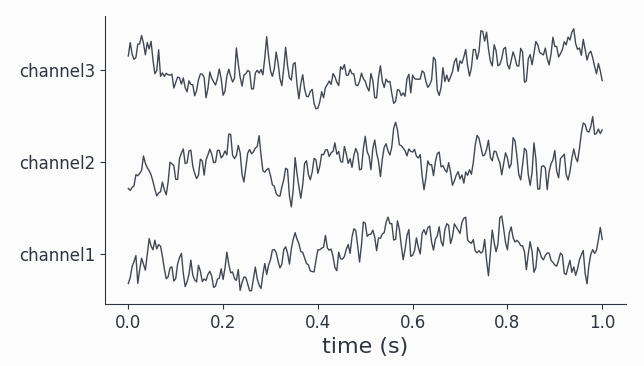
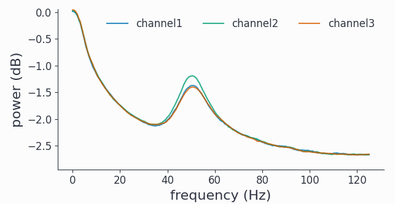
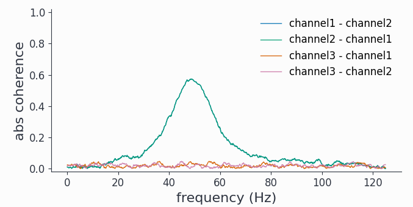
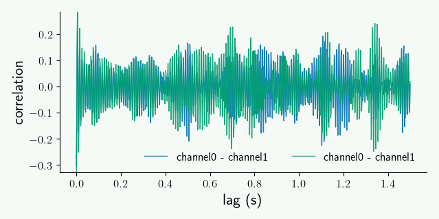
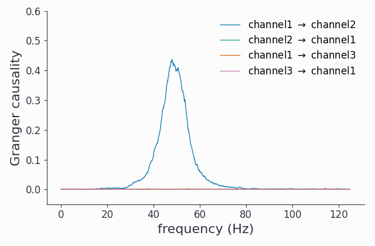

Connectivity Analysis
=====================

Having time-frequency results for individual channels is useful, however we hardly learn anything about functional relationships between different sources. Even if two channels have a spectral peak at say 100Hz, we don't know if these signals are actually connected. Syncopy offers various distinct methods to elucidate such putative connections via the :func:`~syncopy.connectivityanalysis` meta-function: coherence, cross-correlation and Granger-Geweke causality.

.. contents:: Topics covered
   :local:

AR(2) Models
-------------

To have a synthetic albeit meaningful dataset to illustrate the different methodologies we start by simulating two coupled autoregressive processes of order 2:

.. literalinclude:: ar2_nw.py

We also right away calculated the respective power spectra ``spec``.
We can quickly have a look at a snippet of the generated signals::

  data.singlepanelplot(trials=0, latency=[0, 0.5])

Both channels show visible oscillations as is confirmed by looking at the power spectra::

  spec.singlepanelplot()

As expected for the stochastic AR(2) model, we have a fairly broad spectral peak at around 100Hz.

..
   comment
   Careful when using :func:`~syncopy.show` on large datasets, as the output is loaded directly into memory. It is advisable to make sufficiently small selections (e.g. 1 channel, 1 trial) to avoid out-of-memory problems on your machine!

Coherence
---------
One way to check for relationships between different oscillating channels is to calculate the pairwise `coherence <https://en.wikipedia.org/wiki/Coherence_(signal_processing)>`_ measure. It can be roughly understood as a frequency dependent correlation. Let's do this for our coupled AR(2) signals::

  coherence = spy.connectivityanalysis(data, method='coh', tapsmofrq=3)

The result is of type :class:`~syncopy.CrossSpectralData`, the standard datatype for all connectivity measures. It contains the results for all ``nChannels x nChannels`` possible combinations. Let's pick the two available channel combinations and plot the results::

  coherence.singlepanelplot(channel_i='channel1', channel_j='channel2')
  coherence.singlepanelplot(channel_i='channel2', channel_j='channel1')

As coherence is a *symmetric measure*, we have the same graph for both channel combinations, showing high coherence around 100Hz.

.. note::
   The plotting for :class:`~syncopy.CrossSpectralData` objects works a bit differently, as  the user here has to provide one channel combination for each plot with the keywords ``channel_i`` and ``channel_j``.

Cross-Correlation
-----------------
Coherence is a spectral measure for correlation, the corresponding time-domain measure is the well known cross-correlation. In Syncopy we can get the cross-correlation between all channel pairs with::

  corr = spy.connectivityanalysis(data, method='corr', keeptrials=True)

As this also is a symmetric measure, let's just look at the only channel combination however this time for two different trials::

  corr.singlepanelplot(channel_i=0, channel_j=1, trials=0)
  corr.singlepanelplot(channel_i=0, channel_j=1, trials=1)

We see that there are persistent correlations also for longer lags.

Granger Causality
-----------------
To reveal directionality, or *causality*, between different channels Syncopy offers the Granger-Geweke algorithm for non-parametric Granger causality in the spectral domain::

  granger = spy.connectivityanalysis(data, method='granger', tapsmofrq=2)

Now we want to see differential causality, so we plot both channel combinations::

  granger.singlepanelplot(channel_i=0, channel_j=1)
  granger.singlepanelplot(channel_i=1, channel_j=0)

This reveals the coupling structure we put into this synthetic data set: ``channel1`` influences ``channel2``, but in the other direction there is no interaction.

.. note::
   The ``keeptrials`` keyword is only valid for cross-correlations, as both Granger causality and coherence critically rely on trial averaging.
