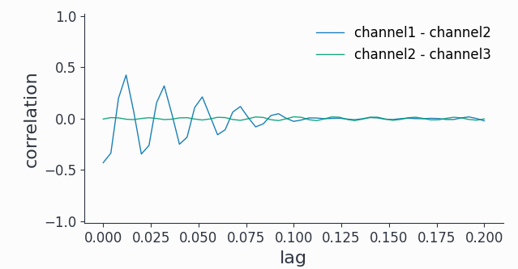
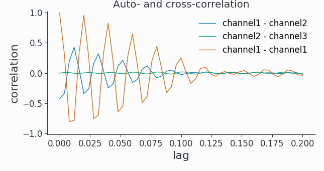

Connectivity Analysis
=====================

Having time-frequency results for individual channels is useful, however we hardly learn anything about functional relationships between different sources. Even if two channels have a spectral peak at say 100Hz, we don't know if these signals are actually connected. Syncopy offers various distinct methods to elucidate such putative connections via the :func:`~syncopy.connectivityanalysis` meta-function: coherence, cross-correlation and Granger-Geweke causality.

.. contents:: Topics covered
   :local:

AR(2) Models
-------------

To have a synthetic albeit meaningful dataset to illustrate the different methodologies we start by simulating three autoregressive processes of order 2:

.. literalinclude:: ar2_nw.py

We also right away calculated the respective power spectra ``spec``.
We can quickly have a look at a snippet of the generated signals::

  data.singlepanelplot(trials=0, latency=[0, 1.])

.. image:: ar2_signals.png
   :height: 260px

All channels show visible oscillations as is confirmed by looking at the power spectra::

  spec.singlepanelplot()

.. image:: ar2_specs.png
   :height: 260px

As expected for the stochastic AR(2) model, we have a fairly broad spectral peak at around 50Hz plus the 1/f like background.

..
   comment
   Careful when using :func:`~syncopy.show` on large datasets, as the output is loaded directly into memory. It is advisable to make sufficiently small selections (e.g. 1 channel, 1 trial) to avoid out-of-memory problems on your machine!

Coherence
---------
One way to check for relationships between different oscillating channels is to calculate the pairwise `coherence <https://en.wikipedia.org/wiki/Coherence_(signal_processing)>`_ measure. It can be roughly understood as a frequency dependent correlation. Let's do this for our coupled AR(2) signals::

  coherence = spy.connectivityanalysis(data, method='coh', tapsmofrq=3)

The result is of type :class:`~syncopy.CrossSpectralData`, the standard datatype for all connectivity measures. It contains the results for all ``nChannels x nChannels`` possible combinations. Let's pick a few available channel combinations and plot the results::

  coherence.singlepanelplot(channel_i='channel1', channel_j='channel2')
  coherence.singlepanelplot(channel_i='channel2', channel_j='channel1')
  coherence.singlepanelplot(channel_i='channel3', channel_j='channel1')
  coherence.singlepanelplot(channel_i='channel3', channel_j='channel2')

.. image:: ar2_coh.png
   :height: 260px

As coherence is a **symmetric measure**, we obtain exactly the same graph for both ``channel1-channel2`` combinations, showing high coherence around 50Hz. However as channel3 is completely uncoupled, there is no coherence with either ``channel1`` or ``channel2``. 

.. note::
   The plotting for :class:`~syncopy.CrossSpectralData` objects works a bit differently, as  the user here has to provide one channel combination for each plot with the keywords ``channel_i`` and ``channel_j``.

Cross-Correlation
-----------------
Coherence is a spectral measure for correlation, the corresponding time-domain measure is the well known cross-correlation. In Syncopy we can get the cross-correlation between all channel pairs with::

  corr = spy.connectivityanalysis(data, method='corr', keeptrials=True)

As this also is a symmetric measure, we just look at only one channel combination for each channel pair::

  corr.singlepanelplot(channel_i=0, channel_j=1, trials=1)
  corr.singlepanelplot(channel_i=0, channel_j=2, trials=1)  
  corr.singlepanelplot(channel_i=1, channel_j=2, trials=1)
  

.. image:: ar2_corr.png
   :height: 260px

As a time domain measure, the cross-correlation is confounded by the 1/f background present in all 3 channels.

We can however use a bandpass filter around 50Hz first and then trial average the cross-correlations to unmask some short-lived (~0.1s) correlations between channel1 and channel2::
  
   bp_filtered = spy.preprocessing(data, filter_type='bp', freq=[45, 55])
   bp_corr = spy.connectivityanalysis(bp_filtered, method='corr', keeptrials=False)
   
   # look only at lags of max. 0.2 seconds
   bp_corr.singlepanelplot(channel_i=0, channel_j=1, latency=[0, 0.2])   
   bp_corr.singlepanelplot(channel_i=1, channel_j=2, latency=[0, 0.2])

   
Note that we can also look at the auto-correlation::

  fig, ax =  bp_corr.singlepanelplot(channel_i=0,
                                     channel_j=0,
				     latency=[0, 0.2])
				     
  ax.set_title('Auto- and cross-correlation')

.. hint::
   Have a look at the :ref:`preproc` section to learn more about pre-processing data with Syncopy.

Granger Causality
-----------------
To reveal directionality, or **causality**, between different channels Syncopy offers the Granger-Geweke algorithm for non-parametric Granger causality in the spectral domain::

  granger = spy.connectivityanalysis(data, method='granger', tapsmofrq=2)

Now we want to see differential causality, so we plot more channel combinations::

  granger.singlepanelplot(channel_i=0, channel_j=1)
  granger.singlepanelplot(channel_i=1, channel_j=0)
  granger.singlepanelplot(channel_i=0, channel_j=2)
  fig, ax = granger.singlepanelplot(channel_i=2, channel_j=0)  
  ax.set_ylim((-.05, 0.6))
  
This reveals the coupling structure we put into this synthetic data set: ``channel1`` influences ``channel2``, but in the other direction there is no interaction. The oscillations in ``channel3`` are completely uncoupled.

.. image:: ar2_granger.png
   :height: 300px

As a spectral method, we did not need to filter out any 1/f component to uncover the coupling topology.

.. note::
   The ``keeptrials`` keyword is only valid for cross-correlations, as both Granger causality and coherence critically rely on trial averaging.
