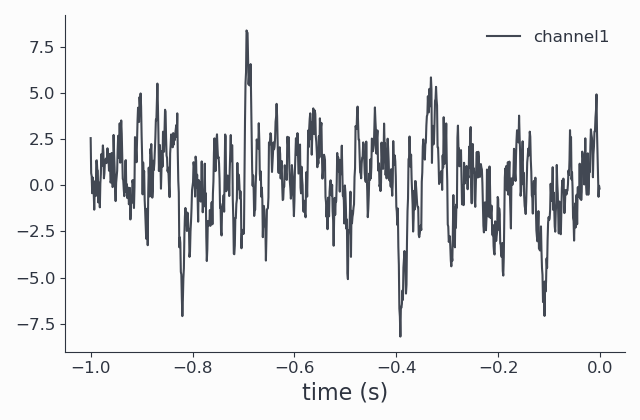
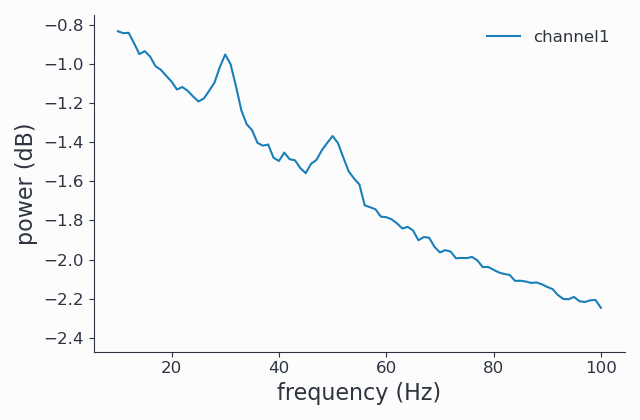
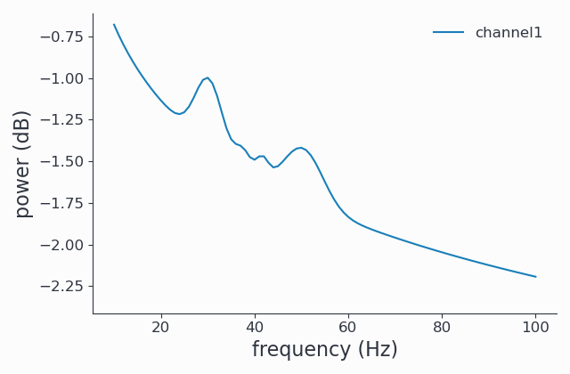

Using FOOOF from Syncopy
========================

Syncopy supports parameterization of neural power spectra using
the `Fitting oscillations & one over f` (`FOOOF <https://github.com/fooof-tools/fooof>`_
) method described in the following publication (`DOI link <https://doi.org/10.1038/s41593-020-00744-x>`_):

`Donoghue T, Haller M, Peterson EJ, Varma P, Sebastian P, Gao R, Noto T, Lara AH, Wallis JD,
Knight RT, Shestyuk A, & Voytek B (2020). Parameterizing neural power spectra into periodic
and aperiodic components. Nature Neuroscience, 23, 1655-1665.
DOI: 10.1038/s41593-020-00744-x`

The FOOOF method requires as input an Syncopy :class:`~syncopy.AnalogData` object, so time series data like for example a LFP signal.
Applying FOOOF can then be seen as a post-processing of a :ref:`multi-tapered Fourier Analysis <mtmfft>`.

Generating Example Data
-----------------------

Let us first prepare
suitable data. FOOOF will typically be applied to trial-averaged data, as the method is
quite sensitive to noise, so we generate an example data set consisting of 500 trials and
a single channel here (see :ref:`the Synthetic data tutorial<synth_data>` for details on this):

.. code-block:: python
    :linenos:

    import numpy as np
    from syncopy import freqanalysis, get_defaults
    from syncopy.tests.synth_data import AR2_network, phase_diffusion

    def get_signals(nTrials=500, nChannels = 1):
        nSamples = 1000
        samplerate = 1000
        ar1_part = AR2_network(AdjMat=np.zeros(1), nSamples=nSamples, alphas=[0.9, 0], nTrials=nTrials)
        pd1 = phase_diffusion(freq=30., eps=.1, fs=samplerate, nChannels=nChannels, nSamples=nSamples, nTrials=nTrials)
        pd2 = phase_diffusion(freq=50., eps=.1, fs=samplerate, nChannels=nChannels, nSamples=nSamples, nTrials=nTrials)
        signal = ar1_part + .8 * pd1 + 0.6 * pd2
        return signal

    signals = get_signals()

The return value `signals` is of type :class:`~syncopy.AnalogData`. Let's have a look at the signal in the time domain first::

    signals.singlepanelplot(trials = 0)

Since FOOOF works on the power spectrum, we can perform an `mtmfft` and look at the results to get
a better idea of how our data looks in the (un-fooofed) frequency domain. The `spec` data structure we obtain is
of type :class:`~syncopy.SpectralData`, and can also be plotted:

.. code-block:: python
    :linenos:

    cfg = get_defaults(freqanalysis)
    cfg.method = "mtmfft"
    cfg.taper = "hann"
    cfg.select = {"channel": 0}
    cfg.keeptrials = False
    cfg.output = "pow"
    cfg.foilim = [10, 100]

    spec = freqanalysis(cfg, dt)
    spec.singlepanelplot()

By construction, we see two spectral peaks around 30Hz and 50Hz and a strong :math:`1/f` like background.

Running FOOOF
-------------

Now that we have seen the more or less raw power spectrum, let us start FOOOF. The FOOOF method is accessible
from the `freqanalysis` function by setting the `output` parameter to `'fooof'`:

.. code-block:: python
    :linenos:

    cfg.output = 'fooof'
    spec_fooof = freqanalysis(cfg, dt)
    spec_fooof.singlepanelplot()

FOOOF output types
^^^^^^^^^^^^^^^^^^

In the example above, the spectrum returned is the full FOOOFed spectrum. This is
typically what you want, but to better understand your results, you may be interested
in the other options. The following ouput types are available:

* **fooof**: the full fooofed spectrum
* **fooo_aperiodic**: the aperiodic part of the spectrum
* **fooof_peaks**: the detected peaks, with Gaussian fit to them

Here we request only the aperiodic (:math:`\sim 1/f`) part and plot it:

.. code-block:: python
    :linenos:

    cfg.output = 'fooof_aperiodic'
    spec_fooof_aperiodic = freqanalysis(cfg, dt)
    spec_fooof_aperiodic.singlepanelplot()

.. image:: ../_static/fooof_out_aperiodic.png

You may want to use a combination of the different return types to inspect
your results.

Knowing what your data and the FOOOF results like is important, because typically
you will have to fine-tune the FOOOF method to get the results you are interested in.

With the data above, we were interested only in the 2 large peaks around 30 and 50 Hz,
but 2 more minor peaks were detected by FOOOF, around 37 and 42 Hz. We will learn
how to exclude these peaks in the next section.

Fine-tuning FOOOF
-----------------

The FOOOF method can be adjusted using the `fooof_opt` parameter to `freqanalyis`. The full
list of available options and defaults are explained in detail in the `official FOOOF documentation <https://fooof-tools.github.io/fooof/generated/fooof.FOOOF.html#fooof.FOOOF>`_.

From the results above, we see that some peaks were detected that we think (and actually know by construction) are noise.
Increasing the minimal peak width is one method to exclude them:

.. code-block:: python
    :linenos:

    cfg.output = 'fooof'
    cfg.fooof_opt = {'peak_width_limits': (6.0, 12.0), 'min_peak_height': 0.2}
    spec_fooof_tuned = freqanalysis(cfg, dt)
    spec_fooof_tuned.singlepanelplot()

Once more, we look at the FOOOFed spectrum:

Note that the two tiny peaks have been removed.

This concludes the tutorial on using FOOOF from Syncopy. Please do not forget to cite `Donoghue et al. 2020 <https://doi.org/10.1038/s41593-020-00744-x>`_ when using FOOOF.

