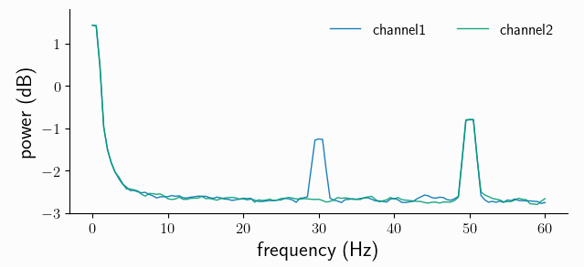

.. _preproc:

Preprocessing
=============

Raw data often contains unwanted signal components: offsets, trends or even oscillatory nuisance signals. Syncopy has a dedicated :func:`~syncopy.preprocessing` function to clean up and/or transform the data. 

.. contents:: Topics covered
   :local:

Let's start by creating a new synthetic signal with confounding components:

.. literalinclude:: /tutorials/preproc_synthdata.py

Here we used a ``cfg`` dictionary to assemble all needed parameters, a concept we adopted from `FieldTrip <https://www.fieldtriptoolbox.org/>`_		    

.. _arithmetics:

Dataset Arithmetics
-------------------

If the *shape* of different Syncopy objects match exactly (``nSamples``, ``nChannels`` and ``nTrials`` are all the same), we can use **standard Python arithmetic operators** like **+**, **-**, ***** and **/** directly. Here we want a linear superposition, so we simply add everything together::

  # add noise, trend and the nuisance harmonic
  data_nui = harm + wn + lin_trend + harm50
  # also works for scalars
  data_nui = data_nui + 5

If we now do a spectral analysis, the power spectra are confounded by all our new signal components::

  cfg = spy.StructDict()
  cfg.tapsmofrq = 1
  cfg.foilim = [0, 60]
  cfg.polyremoval = None
  cfg.keeptrials = False   # trial averaging
  fft_nui_spectra = spy.freqanalysis(data_nui, cfg)

.. note::
   We explicitly set ``polyremoval=None`` to see the full effect of our confounding signal components. The default for :func:`~syncopy.freqanalysis` is ``polyremoval=0``, which removes polynoms of 0th order: constant offsets (*de-meaning*).

.. hint::
   We did not specify the ``method`` parameter for the :func:`~syncopy.freqanalysis` call as multi-tapered Fourier analysis (``method='mtmfft'``) is the default. To learn about the defaults of any Python function you can inspect its signature with ``spy.freqanalysis?`` or ``help(spy.freqanalysis)`` typed into an interpreter

Let's see what we got::

  fft_nui_spectra.singlepanelplot()

We see strong low-frequency components, originating from both the offset and the trend. We also see the nuisance signal spectral peak at 50Hz.

Filtering
---------
Filtering of signals in general removes/suppresses unwanted signal components. This can be done both in the *time-domain* and in the *frequency-domain*. For offsets and (low-order) polynomial trends, fitting a model directly in the time domain, and subtracting the obtained trend, is the preferred solution. This can be controlled in Syncopy with the ``polyremoval`` parameter, which is also directly available in :func:`~syncopy.freqanalysis`.

Removing signal components in the frequency domain is typically done with *finite impulse response* (FIR) filters or *infinite impulse response* (IIR) filters. Syncopy supports one of each kind, a FIR `windowed sinc <https://en.wikipedia.org/wiki/Sinc_filter>`_ and the `Butterworth filter <https://en.wikipedia.org/wiki/Butterworth_filter>`_ from the IIR family. For both filters we have low-pass (``'lp'``), high-pass (``'hp'``), band-pass (``'bp'``) and band-stop(Notch) (``'bp'``) designs available.

To clean up our dataset above, we remove the linear trend and apply a low-pass 12th order Butterworth filter::

  data_pp = spy.preprocessing(data_nui,
                              filter_class='but',
			      filter_type='lp',
			      polyremoval=1,
			      freq=40,
			      order=12)

Now let's reuse our ``cfg`` from above to repeat the spectral analysis with the preprocessed data::

  spec_pp = spy.freqanalysis(data_pp, cfg)
  spec_pp.singlepanelplot()

.. image:: fft_pp_spec.png
   :height: 250px

As expected for a low-pass filter, all frequencies above 40Hz are strongly attenuated (note the log scale, so the suppression is around 2 orders of magnitude). We also removed the low-frequency components from the offset and trend, but acknowledge that we also lost a bit of the original white noise power around 0-2Hz. Importantly, the spectral power of our frequency band of interest, around 30Hz, remained virtually unchanged.
