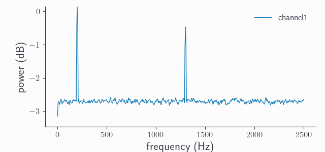
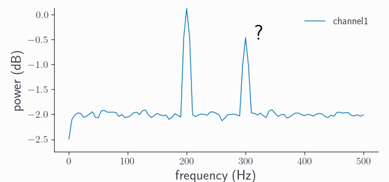
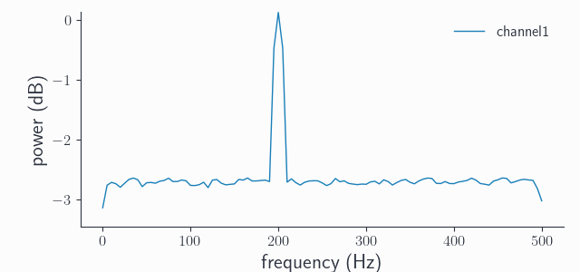
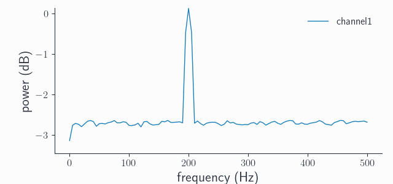
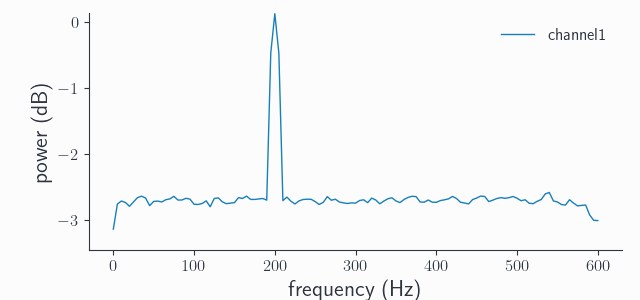

Resample data with Syncopy
==========================

Changing the sampling rate of a dataset is a common task in digital signal processing. Syncopy offers simple *downsampling* (decimation) with or without explicit low pass filtering, and the numerically more expensive *resampling* to arbitrary new sampling rates.

.. Note::
   Our friends at FieldTrip also have a nice tutorial about resampling `here <https://www.fieldtriptoolbox.org/faq/resampling_lowpassfilter>`_

.. contents:: Topics covered
   :local:

Synthetic Data
--------------

To start with a clean slate, let's construct a synthetic signal with two harmonics,
one at 200Hz and one at 1300Hz:

.. code-block:: python
    :linenos:

    # Import package
    import syncopy as spy
    from syncopy.tests import synth_data

    # basic dataset properties
    nTrials = 100
    samplerate = 5000  # in Hz

    # add a strong harmonic with 200Hz
    adata = 2 * synth_data.harmonic(nTrials, freq=200, samplerate=samplerate)

    # add another harmonic with 1300Hz
    adata += synth_data.harmonic(nTrials, freq=1300, samplerate=samplerate)

    # white noise floor
    adata += synth_data.white_noise(nTrials, samplerate=samplerate)

Note that our *original sampling rate* is 5000Hz, so both harmonics are well sampled as can be seen in the power spectrum::

  # compute the trial averaged spectrum and plot
  spec = spy.freqanalysis(adata, keeptrials=False)
  spec.singlepanelplot(channel=0)

Downsampling
------------

Suppose we want to downsample our signal to 1kHz. The *original sampling rate* here is an exact integer multiple of our *new sampling rate*: :math:`5 \times 1000Hz = 5000Hz`. Hence, we can use direct *decimation* or downsampling. This is only a fancy term for taking every `nth` data point, where `n` is the integer division factor, which is 5 in our case. In Syncopy we can directly use :func:`~syncopy.resampledata` with ``method='downsample'`` and the target sampling rate ``resamplefs`` set to 1000Hz::

  ds_adata = spy.resampledata(adata, method='downsample', resamplefs=1000)

Let's have a look at the new power spectrum:

  ds_spec = spy.freqanalysis(adata, keeptrials=False)
  ds_spec.singlepanelplot(channel=0)

What happened? First we have to note that the frequency axis now goes from 0Hz to only 500Hz, which is the *new Nyquist frequency* :math:`1000Hz / 2`. We still see our expected peak at 200Hz, but there is also another one at 300Hz even though our signal never contained such oscillations! This phenomenon is called `aliasing <https://en.wikipedia.org/wiki/Aliasing>`_, basically meaning that frequencies which are present in the signal yet are higher than the Nyquist limit (:math:`1300 Hz > 500Hz`) "wrap around" and re-appear as spurious low-frequency components. This is a common problem of *digitization* of analog signals, think audio processing. The formula for the alias frequencies is:

.. math::

   f_{alias} = \left |\frac{f_{sample}}{n} - f_{orig}\right |

where :math:`f_{sample}` is the original sampling frequency, :math:`n = \frac{f_{sample}}{f_{resample}}` is the integer decimation factor and :math:`f_{orig}` is the original frequency. Plugging in the values we have gives: :math:`|5000Hz / 5 - 1300Hz| = 300Hz`. So this 300Hz peak is the alias of our original 1300Hz peak, but shifted by 1000Hz.

.. note::
   To calculate the alias frequencies for original frequencies which after one application of the formula above are still outside the new frequency range, just re-apply the formula. For example say :math:`f_{orig} = 1700Hz`, after one round we get :math:`|1000Hz - 1700Hz| = 700Hz` which is still outside our spectral range of 0-500Hz. A 2nd iteration then yields :math:`1000Hz - 700Hz = 300Hz`, meaning that both 1300Hz and 1700Hz get aliased by the 300Hz frequency in the spectrum of the downsampled signal, try it yourself ;)

Low-pass filtering
^^^^^^^^^^^^^^^^^^

To circumvent the problem of aliasing, application of a so-called *anti-alias-filter* is advisable. There is nothing special with that filter as such, basically every low-pass filter will work. The critical step is to filter out all frequencies which are greater than the *new Nyquist frequency*. Filtering out more than those does not introduce additional artifacts, however setting the cut-off too high gets only partially rid of the aliasing. In Syncopy we enforce that if a filtering step is requested by setting the cut-off frequency ``lpfreq`` parameter, it has to be maximally the new Nyquist. So trying::

  ds_data2 = spy.resampledata(adata, method='downsample', resamplefs=1000, lpfreq=600)

throws::

  >>> SPYValueError: Invalid value of `lpfreq`: '600'; expected value to be greater or equals 0 and less or equals 500.0

because 600Hz is still bigger than the new Nyquist of :math:`1000Hz / 2 = 500Hz`. But this here will work just fine and results in the expected spectrum::

  ds_data2 = spy.resampledata(adata, method='downsample', resamplefs=1000, lpfreq=500)
  ds_spec2 = spy.freqanalysis(ds_adata2, keeptrials=False)
  ds_spec2.singlepanelplot(channel=0)

Note the appearance of a "nose" in the spectrum towards 500Hz, this is the *filter roll-off*. Syncopy uses a windowed sinc FIR filter as anti-aliasing filter, but no filter is perfect so some frequencies away from the 500Hz cut-off also get attenuated. We can sharpen the filter by increasing its order, Syncopy's default is ``order=1000``, let's try with ``order=5000``::

  ds_data3 = spy.resampledata(adata, method='downsample', resamplefs=1000, lpfreq=500, order=5000)
  ds_spec3 = spy.freqanalysis(ds_adata3, keeptrials=False)
  ds_spec3.singlepanelplot(channel=0)

Indeed, we see a sharper transition around the 500Hz cut-off frequency. In practice, the frequencies of interest are rarely near the Nyquist limit so the default order should be fine for most if not all cases.

.. note::

   Comparing the 200Hz spectral peak height between all shown spectra, we see that it's constant. This is an important property of any spectral analysis: to let wanted frequencies pass through essentially unaltered.

As a final note, the reason we give the user the choice if low-pass filtering is required for downsampling, is that we also have :func:`syncopy.preprocessing`. So if proper filtering was done *before*, there is no need to filter again.

Resampling
----------

What happens if our new sampling frequency happens to *not* be an integer multiple of the old sampling frequency? In this case the standard method is often called *up-fir-down*, which is an abbreviation for upsampling, FIR filtering and downsampling. So it is a three step process, where up- and downsampling are actually both done by integer factors :math:`up` and :math:`down`. The FIR filter is again an implicit anti-aliasing filter, acting on the upsampled signal. The numerical cost of this algorithm critically depends on the sampling factors, which must fulfill:

.. math::

   f_{resample} = \frac{up}{down} f_{sample}

These numbers directly depend on the greatest common divisor :math:`gcd` between :math:`f_{sample}` and :math:`f_{resample}`. So we can also write :math:`up = \frac{f_{resample}}{gcd}` and :math:`down = \frac{f_{sample}}{gcd}`. Suppose we want to resample our original signal from 5kHz to 1200Hz: we have :math:`gcd = 200` and it follows that :math:`up = 6` and :math:`down = 25` , which isn't to bad and we call :func:`syncopy.resampledata` with ``method='resample'``::

  rs_adata = spy.resampledata(adata, method='resample', resamplefs=1200)
  rs_spec = spy.freqanalysis(rs_adata, keeptrials=False)
  rs_spec.singlepanelplot(channel=0)

This time we did not get a spurious additional peak, as for resampling the FIR step acts as an implicit anti-alias filter getting automatically rid of any aliases. We could again increase the sharpness towards the new Nyquist frequency of 600Hz by increasing the order, but we'll leave that to the interested reader.

Under the hood, Syncopy leverages the efficient polyphase method from `SciPy's reference implementation <https://docs.scipy.org/doc/scipy/reference/generated/scipy.signal.resample_poly.html>`_, but we use our own windowed sinc as it provides a sharper roll-off compared to SciPy's default FIR filter.

.. note::

   If the :math:`gcd` is quite small, the up- and downsampling factors can get huge. As the anti-aliasing FIR filter acts on the upsampled signal, the default filter order can get insufficient and aliases start to reappear. In these cases manually setting a higher order is crucial. As an exercise, try resampling to :math:`f_{resample} = 1202Hz`, and see for yourself!
