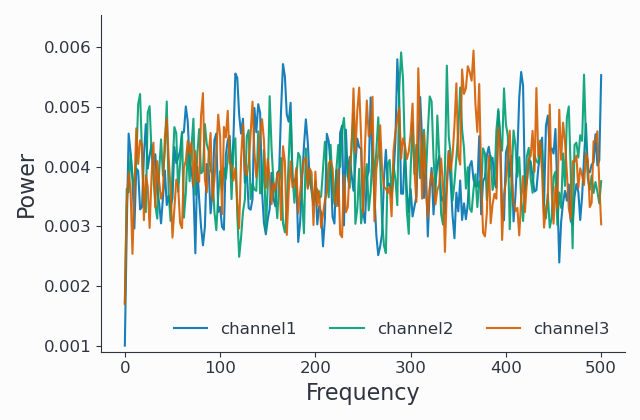

Running Welch's method for the estimation of power spectra in Syncopy
=====================================================================

Welch's method for the estimation of power spectra based on time-averaging over short, modified periodograms
is described in the following publication (`DOI link <https://doi.org/10.1109/TAU.1967.1161901>`_):

`Welch, P. (1967). The use of fast Fourier transform for the estimation of power spectra:
a method based on time averaging over short, modified periodograms.
IEEE Transactions on Audio and Electroacoustics, 15(2), 70-73.`

In short, it splits the original time-domain signal into several, potentially overlapping, segments. A taper (window function) is then applied,
and the data is transferred into the frequency domain by computing the FFT. Computing the squared magnitude results in one periodogram per segment.
Welch refers to these as *modified periodograms* in the publication, because of the taper that has been applied. These
powers are averaged over the windows to obtain the final estimate of the power spectrum.

Due to the averaging, Welch's method works well with noisy data: the averaging reduces the variance of the estimator. The price to pay is a
reduced frequency resolution due to the short input segments compared to the single, full-sized signal.

Generating Example Data
-----------------------

Let us first prepare suitable data, we use white noise here:

.. code-block:: python
    :linenos:

    import syncopy as spy
    import syncopy.tests.synth_data as synth_data

    wn = synth_data.white_noise(nTrials=2, nChannels=3, nSamples=20000, samplerate=1000)

The return value `wn` is of type :class:`~syncopy.AnalogData` and contains 2 trials and 3 channels,
each consisting of 20 seconds of white noise: 20000 samples at a sample rate of 1000 Hz. We can show this easily:

.. code-block:: python
    :linenos:

    wn.dimord       # ['time', 'channel']
    wn.data.shape   # (40000, 3)
    wn.trialdefinition # array([[    0., 20000., -1000.], [20000., 40000., -1000.]])

Spectral Analysis using Welch's Method
--------------------------------------

We now create a config for running Welch's method and call `freqanalysis` with it:

.. code-block:: python
    :linenos:

    cfg = spy.get_defaults(spy.freqanalysis)
    cfg.method = "welch"
    cfg.t_ftimwin = 0.5  # Window length in seconds.
    cfg.toi = 0.0        # Overlap between windows, 0.5 = 50 percent overlap.

    welch_res = spy.freqanalysis(cfg, wn)

Let's inspect the resulting `SpectralData` instance by looking at its dimensions, and then visualize it:

.. code-block:: python
    :linenos:

    welch_res.dimord      # ('time', 'taper', 'freq', 'channel',)
    welch_res.data.shape  # (2, 1, 251, 3)

The shape is as expected:

* The `time` axis contains two entries, one per trial, because by default there is no trial averaging (`cfg.keeptrials` is `True`). With trial averaging, there would only be a single entry here.
* The `taper` axis will always have size 1 for Welch, even for multi-tapering, as taper averaging must be active for Welch (`cfg.keeptapers` must be `False`), as explained in the function documentation.
* The size of the frequency axis (`freq`, 512 here), i.e., the frequency resolution, depends on the signal length of the input windows and is thus a function of the input signal, `cfg.t_ftimwin`, `cfg.toi`, and potentially other settings (like a `foilim`, i.e. a frequency selection).
* The channels are unchanged, as we receive one result per channel.

We can also visualize the power spectrum. Here we select the first of the two trials:

.. code-block:: python
    :linenos:

    _, ax = welch_res.singlepanelplot(trials=0, logscale=False)
    ax.set_ylabel("Power")
    ax.set_xlabel("Frequency")

We can see the estimated power spectrum for three channels of white noise.

Investigating the Effects of the Window Length and Overlap Parameters as a Function of Signal Length
-----------------------------------------------------------------------------------------------------

Many settings affect the outcome of a Welch run, including:

* `cfg.t_ftimwin` : window length (a.k.a. segment length) in seconds.
* `cfg.toi`       : overlap between windows, 0.5 = 50 percent overlap.
* `cfg.taper` and `cfg.tapsmofrq` : for taper selection and multi-tapering. Note that in case of multi-tapering, the data in the windows will be averaged across the tapers first, then the Welch procedure will run.

Data selections are also possible, like in all Syncopy functions. So you can use `cfg.foilim` to select only a specific frequency range, e.g., `cfg.foilim = [5.0, 100.0]` to select 5 to 100 Hz.

Here, we want to illustrate the effects of two important parameters, the window length and the overlap between windows, on signals of different lengths.

TODO: add plot here

This concludes the tutorial on using Welch's method in Syncopy.
