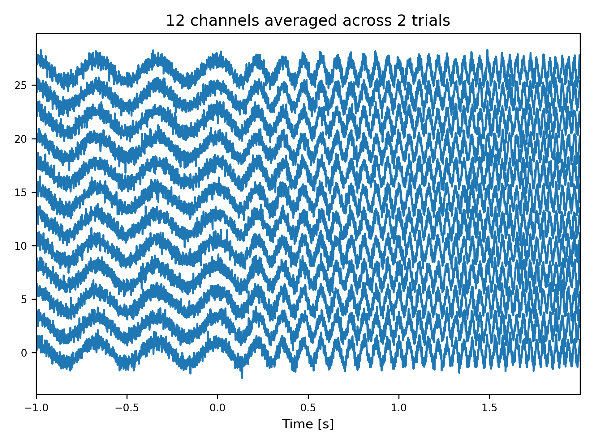
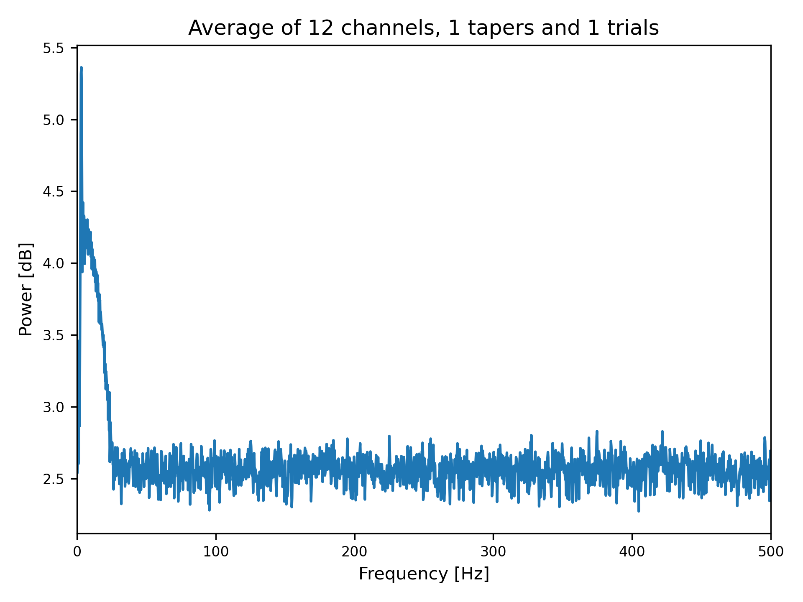

Data Analysis and Processing
============================
Data analysis pipelines are inspired by the well established and feature-rich 
`MATLAB <https://mathworks.com>`_ toolbox `FieldTrip <http://www.fieldtriptoolbox.org>`_.
Syncopy aims to emulate FieldTrip's basic usage concepts. 

Syncopy Meta-Functions
----------------------
All of Syncopy's computing managers (like :func:`~syncopy.freqanalysis`) can be 
either called using positional/keyword arguments following standard Python syntax, 
e.g., 

.. code-block:: python
      
    spec = spy.freqanalysis(data, method="mtmfft", foilim=[1, 150], output="pow", taper="dpss", tapsmofrq=10)

or using a ``cfg`` configuration structure:

.. code-block:: python
      
    cfg = spy.get_defaults(spy.freqanalysis)
    cfg.method = 'mtmfft';
    cfg.foilim = [1, 150];
    cfg.output = 'pow';
    cfg.taper = 'dpss';
    cfg.tapsmofrq = 10;
    spec = spy.freqanalysis(cfg, data)

Serial and Parallel Processing
------------------------------
By default, all computations in Syncopy are executed sequentially relying solely 
on low-level built-in parallelization offered by external libraries like `NumPy <https://numpy.org/>`_. 
The simplest way to enable full concurrency for a given Syncopy calculation 
is by using the `parallel` keyword supported by all Syncopy meta-functions, i.e., 

.. code-block:: python
      
    spec = spy.freqanalysis(data, method="mtmfft", foilim=[1, 150], output="pow", taper="dpss", tapsmofrq=10, parallel=True)

or 

.. code-block:: python
      
    cfg = spy.get_defaults(spy.freqanalysis)
    cfg.method = 'mtmfft'
    cfg.foilim = [1, 150]
    cfg.output = 'pow'
    cfg.taper = 'dpss'
    cfg.tapsmofrq = 10
    cfg.parallel = True
    spec = spy.freqanalysis(cfg, data)

More fine-grained control over allocated resources and load-balancer options is available 
via the routine :func:`~syncopy.esi_cluster_setup`. It permits to launch a custom-tailored 
"cluster" of parallel workers (corresponding to CPU cores if run on a single machine, i.e., 
laptop or workstation, or compute jobs if run on a cluster computing manager such as SLURM).
Thus, instead of simply "turning on" parallel computing via a keyword and letting 
Syncopy choose an optimal setup for the computation at hand, more fine-grained 
control over resource allocation and management can be achieved via running 
:func:`~syncopy.esi_cluster_setup` **before** launching the actual calculation. 
For example,

.. code-block:: python

    spyClient = spy.esi_cluster_setup(partition="16GBXL", n_jobs=10)

starts 10 concurrent SLURM workers in the `16GBXL` queue if run on the ESI HPC 
cluster. All subsequent invocations of Syncopy analysis routines will automatically 
pick up ``spyClient`` and distribute any occurring computational payload across 
the workers collected in ``spyClient``. 

Visualization
-------------
Syncopy offers convenience functions for quick visual inspection of its data objects:

.. code-block:: python

    import matplotlib.pyplot as plt
    plt.ion() # enable "pop-out" figures

    # generate synthetic data
    from syncopy.tests.misc import generate_artificial_data
    adata = generate_artificial_data(nChannels=12)

    # plot each channel in `adata` inside one panel
    spy.singlepanelplot(adata, avg_channels=False)

    # compute dummy spectrum of `adata` and have a look at it
    spec = spy.freqanalysis(adata, method="mtmfft", output="pow", keeptrials=False)
    spy.singlepanelplot(spec)

For more information, please refer to the documentation of :func:`~syncopy.singlepanelplot`
and :func:`~syncopy.multipanelplot`.
