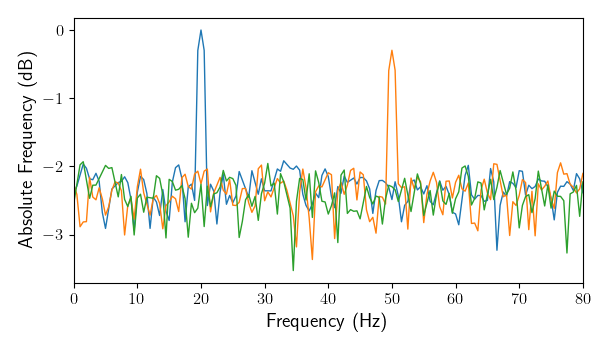

.. _synth_data:
   
Synthetic Data
==============

For testing and demonstrational purposes it is always good to work with synthetic data. Syncopy brings its own suite of synthetic data generators, but it is also possible to devise your own synthetic data and conveniently analyze it with Syncopy.

.. contents::
   :local:

.. _gen_synth_recipe:

General Recipe
--------------

To create a synthetic data set follow these steps:

- write a function which returns a single trial with desired shape ``(nSamples, nChannels)``, such that each trial is a 2d-:class:`~numpy.ndarray`
- collect all the trials into a Python ``list``, for example with a list comprehension or simply a for loop
- Instantiate an  :class:`~syncopy.AnalogData` object by passing this list holding the trials and set the samplerate

In (pseudo-)Python code:

.. code-block:: python

   def generate_trial(nSamples, nChannels):
     	
	trial = .. something fancy ..
	
	# These should evaluate to True
	isinstance(trial, np.ndarray)
	trial.shape == (nSamples, nChannels)	
	
	return trial

   # here we use a list comprehension
   trial_list = [generate_trial(nSamples, nChannels) for _ in range(nTrials)]
   
   my_fancy_data = spy.AnalogData(trial_list, samplerate=my_samplerate)

.. note::
    The same recipe can be used to generally instantiate Syncopy data objects from NumPy arrays.

Built-in Generators
-------------------

These generators return single-trial NumPy arrays, so to import them into Syncopy use the :ref:`gen_synth_recipe` described above.

.. currentmodule:: syncopy.tests.synth_data
.. autofunction:: phase_diffusion
.. autofunction:: AR2_network

Example: Noisy Harmonics
---------------------------

We can easily create custom synthetic datasets using basic `NumPy <https://numpy.org>`_ functionality and Syncopy's :class:`~syncopy.AnalogData`.
Let's create two harmonics and add some white noise to it:

.. literalinclude:: /scripts/synth_data1.py

Here we first defined the number of trials and then the number of samples and channels per trial. With a sampling rate of 500Hz and 1000 samples this gives us a trial length of two seconds. The function ``generate_noisy_harmonics`` adds white noise to all channels, a 20Hz harmonic on the 1st channel and a 50Hz harmonic on the 2nd channel. Every trial got collected into a Python ``list``, which at the last line was used to initialize our :class:`~syncopy.AnalogData` object. Note that data instantiated that way always has a default trigger offset of -1 seconds.

Now we can directly run a simple FFT analysis and plot the power spectra of all 3 channels:

.. code-block:: python

   spectrum = spy.freqanalysis(synth_data, foilim=[0,80], keeptrials=False)
   spectrum.singlepanelplot()
   

|

As constructed, we have two harmonic peaks at the respective frequencies (20Hz and 50Hz) and the white noise floor on all channels.

